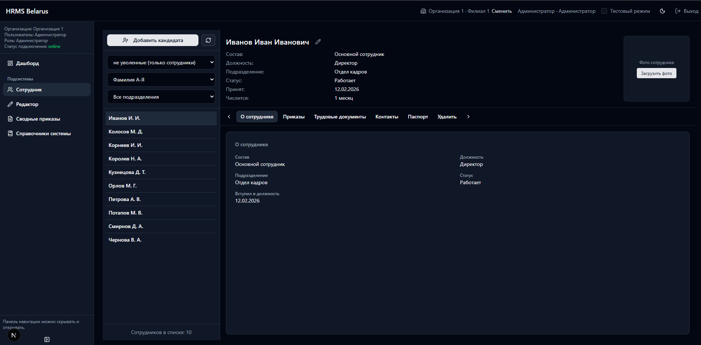
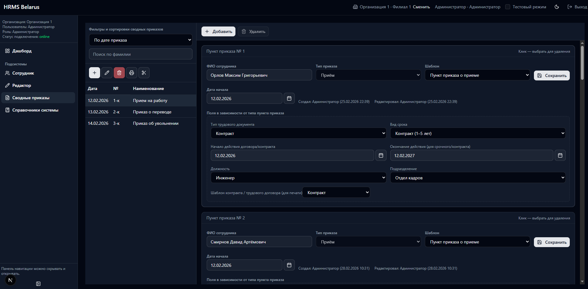
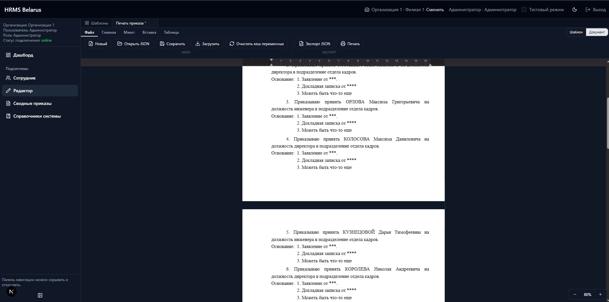
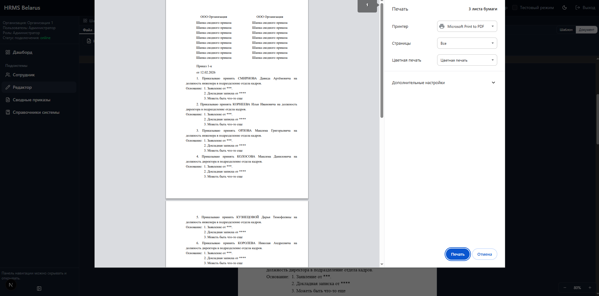

# HRMS Belarus

**HR-система для Беларуси** — кадровый учёт, приказы, сотрудники, отпуска, трудовые договоры.


Telegram: https://t.me/hrmsbelarus
Telegram chat https://t.me/+HcSxdLmm-RFlYzdi

---

## Описание

Веб-приложение для управления персоналом с учётом законодательства Республики Беларусь. Система построена на событийной модели: приказы являются источником истины, а состояние сотрудников (занятость, назначения, отсутствия) — проекция применённых пунктов приказов.

## Стек

| Компонент | Технология |
|-----------|------------|
| **Фронтенд** | Next.js 16, React 19, TypeScript, Tailwind CSS 4 |
| **UI** | Radix UI, Base UI, Lucide Icons, TipTap (редактор) |
| **State** | Zustand, React Context |
| **Бэкенд-логика** | n8n (workflow automation, webhooks) |
| **БД и Auth** | Supabase (self-hosted Docker) — PostgreSQL 15, GoTrue |
| **Инфраструктура** | Docker Compose, Kong API Gateway |

## Архитектура

```
┌─────────────┐     ┌─────────┐     ┌──────────────────┐
│  hrms-web   │────▶│   n8n   │────▶│    Supabase DB   │
│  (Next.js)  │     │ webhooks│     │   (PostgreSQL)   │
└─────────────┘     └─────────┘     └──────────────────┘
     :3000             :5678         :5432 (via Kong :8000)
```

- **Фронт → только n8n.** Все запросы идут через вебхуки n8n. Прямых вызовов Supabase с фронта нет (кроме Auth).
- **n8n** — бизнес-логика, CRUD, валидации, комплаенс.
- **Supabase** — PostgreSQL, Auth (JWT), Storage, RLS.

## Структура проекта

```
HRMS Belarus/
├── hrms-web/              # Фронтенд (Next.js)
│   ├── app/               # Маршруты (auth, dashboard)
│   ├── components/        # UI-компоненты
│   ├── features/          # Доменные модули (employees, documents, editor, ...)
│   ├── lib/               # n8n-клиент, auth, utils
│   └── .env.example       # Шаблон переменных окружения
├── docker/                # Docker Compose, Supabase override
├── setup/                 # Скрипты развёртывания (5 шагов)
├── scripts/               # Утилиты (backup-db.ps1)
├── backups/               # Резервные копии БД
└── docker-compose.yml     # n8n + hrms-web
```

## Быстрый старт

### Требования

- **Windows** 10/11 (x64)
- **Docker Desktop** 4.x (Linux containers)
- **Git** 2.x

### Установка

```powershell
git clone https://github.com/MMMonarch/HRMS-Belarus.git
cd HRMS-Belarus

.\setup\01-install-prerequisites.ps1   # Проверка зависимостей
.\setup\02-setup-supabase.ps1          # Клонирование Supabase, создание .env
copy hrms-web\.env.example hrms-web\.env.local   # Настройка переменных фронта
.\setup\03-start-stack.ps1             # Запуск Docker-стека
.\setup\04-restore-db.ps1              # Восстановление БД из бэкапа (если есть)
.\setup\05-healthcheck.ps1             # Проверка здоровья сервисов
```

Подробная инструкция: [`setup/README.md`](setup/README.md)

### Порты

| Сервис | Порт |
|--------|------|
| hrms-web (фронтенд) | 3000 |
| n8n | 5678 |
| Supabase API (Kong) | 8000 |
| PostgreSQL (Supavisor) | 5432 |

## Документация

| Файл | Описание |
|------|----------|
| [`setup/README.md`](setup/README.md) | Развёртывание на новой машине |
| [`hrms-web/ARCHITECTURE.md`](hrms-web/ARCHITECTURE.md) | Архитектура фронтенда |
| [`docker/README.md`](docker/README.md) | Docker-инфраструктура |
| [`backups/README.md`](backups/README.md) | Резервное копирование |

## Скриншоты

### Карточка сотрудника


### Сводные приказы


### Редактор шаблонов


### Печать приказа


## Лицензия

[MIT](LICENSE)


